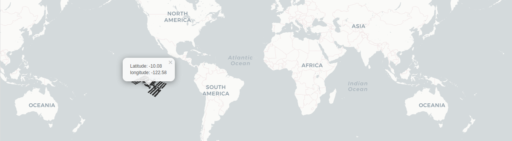
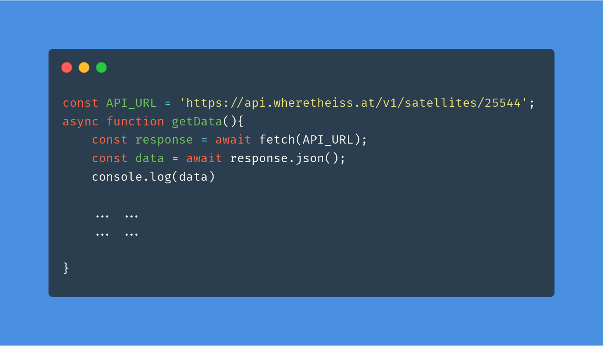

# Internation Space Station Tracker
See Live - https://niyazed.github.io/iss_locator/

Data fetching snippet - 

Get data stream from https://api.wheretheiss.at/v1/satellites/25544
```json
{
    "name": "iss",
    "id": 25544,
    "latitude": 50.11496269845,
    "longitude": 118.07900427317,
    "altitude": 408.05526028199,
    "velocity": 27635.971970874,
    "visibility": "daylight",
    "footprint": 4446.1877699772,
    "timestamp": 1364069476,
    "daynum": 2456375.3411574,
    "solar_lat": 1.3327003598631,
    "solar_lon": 238.78610691196,
    "units": "kilometers"
}
```
